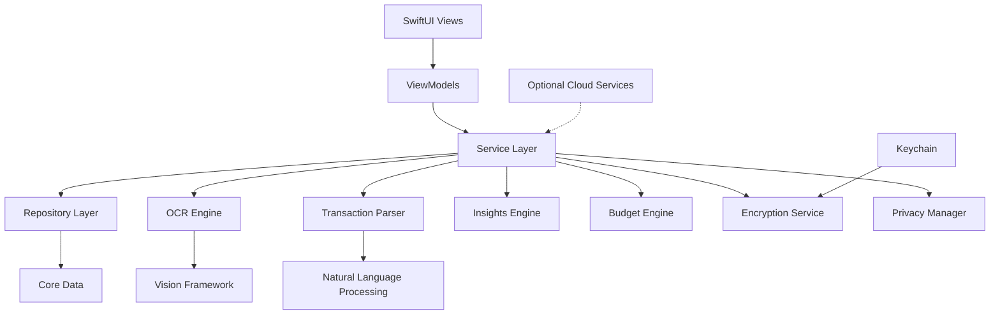

# Design Document

## Overview

ClariFi is architected as a privacy-first iOS application that processes financial data entirely on-device by default, with optional encrypted cloud processing for enhanced features. The system uses a modular architecture with clear separation between data ingestion, processing, storage, and presentation layers. The design prioritizes user privacy, offline functionality, and data ownership while providing a seamless user experience for financial management.

## Architecture

### High-Level Architecture



### Core Architectural Principles

1. **Privacy by Design**: All processing happens locally by default, with explicit opt-in for cloud features
2. **Offline First**: Full functionality without network connectivity
3. **Modular Design**: Clear separation of concerns with dependency injection
4. **Data Encryption**: All sensitive data encrypted at rest using iOS Keychain
5. **Progressive Enhancement**: Basic features work on all devices, advanced features require newer hardware

## Components and Interfaces

### 1. Data Layer

#### Core Data Models

```swift
// Transaction Entity
class Transaction: NSManagedObject {
    @NSManaged var id: UUID
    @NSManaged var date: Date
    @NSManaged var merchant: String
    @NSManaged var amount: Decimal
    @NSManaged var currency: String
    @NSManaged var category: String
    @NSManaged var confidence: Float
    @NSManaged var isManual: Bool
    @NSManaged var notes: String?
    @NSManaged var account: Account
    @NSManaged var statement: Statement?
}

// Account Entity
class Account: NSManagedObject {
    @NSManaged var id: UUID
    @NSManaged var name: String
    @NSManaged var type: String // credit, debit, cash
    @NSManaged var lastFourDigits: String?
    @NSManaged var transactions: Set<Transaction>
}

// Budget Entity
class Budget: NSManagedObject {
    @NSManaged var id: UUID
    @NSManaged var name: String
    @NSManaged var period: String // monthly, weekly
    @NSManaged var startDate: Date
    @NSManaged var categories: Set<BudgetCategory>
}

// Statement Entity
class Statement: NSManagedObject {
    @NSManaged var id: UUID
    @NSManaged var fileName: String
    @NSManaged var uploadDate: Date
    @NSManaged var fileHash: String
    @NSManaged var processingStatus: String
    @NSManaged var transactions: Set<Transaction>
}
```

#### Repository Pattern

```swift
protocol TransactionRepository {
    func save(_ transaction: Transaction) async throws
    func fetchAll() async throws -> [Transaction]
    func fetchByDateRange(_ start: Date, _ end: Date) async throws -> [Transaction]
    func delete(_ transaction: Transaction) async throws
    func batchUpdate(_ transactions: [Transaction]) async throws
}

protocol BudgetRepository {
    func save(_ budget: Budget) async throws
    func fetchActive() async throws -> Budget?
    func fetchAll() async throws -> [Budget]
}
```

### 2. Service Layer

#### OCR Service

```swift
protocol OCRService {
    func processDocument(_ data: Data, type: DocumentType) async throws -> OCRResult
    func processImage(_ image: UIImage) async throws -> OCRResult
}

struct OCRResult {
    let rawText: String
    let confidence: Float
    let boundingBoxes: [TextBoundingBox]
    let processingTime: TimeInterval
}

class VisionOCRService: OCRService {
    // Uses iOS Vision framework for on-device text recognition
    // Handles PDF parsing, image preprocessing, and text extraction
}
```

#### Transaction Parser Service

```swift
protocol TransactionParserService {
    func parseTransactions(from text: String, format: StatementFormat) async throws -> [ParsedTransaction]
    func improveAccuracy(with userCorrections: [TransactionCorrection]) async
}

struct ParsedTransaction {
    let date: Date?
    let merchant: String?
    let amount: Decimal?
    let confidence: TransactionConfidence
    let rawText: String
}

struct TransactionConfidence {
    let date: Float
    let merchant: Float
    let amount: Float
    let overall: Float
}
```

#### Privacy Manager

```swift
protocol PrivacyManager {
    var processingMode: ProcessingMode { get set }
    var dataRetentionPeriod: TimeInterval { get set }
    
    func exportUserData() async throws -> Data
    func deleteAllUserData() async throws
    func getDataSummary() async -> DataSummary
}

enum ProcessingMode {
    case localOnly
    case cloudOptIn
}

struct DataSummary {
    let totalTransactions: Int
    let storageSize: Int64
    let oldestTransaction: Date?
    let newestTransaction: Date?
}
```

#### Insights Engine

```swift
protocol InsightsEngine {
    func generateInsights(for transactions: [Transaction], budget: Budget?) async -> [Insight]
    func generateSpendingTrends(for period: DateInterval) async -> SpendingTrends
}

struct Insight {
    let id: UUID
    let type: InsightType
    let title: String
    let description: String
    let actionItems: [ActionItem]
    let confidence: Float
    let dataSource: [Transaction]
}

enum InsightType {
    case spendingTrend
    case budgetAlert
    case savingsOpportunity
    case recurringCharge
}
```

### 3. Presentation Layer

#### View Architecture

```swift
// Main navigation structure
struct MainTabView: View {
    @StateObject private var appState = AppState()
    
    var body: some View {
        TabView {
            DashboardView()
                .tabItem { Label("Dashboard", systemImage: "chart.pie") }
            
            TransactionsView()
                .tabItem { Label("Transactions", systemImage: "list.bullet") }
            
            BudgetView()
                .tabItem { Label("Budget", systemImage: "target") }
            
            PrivacyView()
                .tabItem { Label("Privacy", systemImage: "lock.shield") }
        }
        .environmentObject(appState)
    }
}

// Statement upload flow
struct StatementUploadView: View {
    @StateObject private var viewModel = StatementUploadViewModel()
    
    var body: some View {
        NavigationView {
            VStack {
                DocumentPicker(onDocumentSelected: viewModel.processDocument)
                
                if viewModel.isProcessing {
                    ProcessingView(progress: viewModel.progress)
                }
                
                if !viewModel.parsedTransactions.isEmpty {
                    TransactionReviewView(
                        transactions: viewModel.parsedTransactions,
                        onConfirm: viewModel.confirmTransactions
                    )
                }
            }
        }
    }
}
```

#### ViewModels

```swift
@MainActor
class StatementUploadViewModel: ObservableObject {
    @Published var isProcessing = false
    @Published var progress: Float = 0
    @Published var parsedTransactions: [ParsedTransaction] = []
    @Published var error: AppError?
    
    private let ocrService: OCRService
    private let parserService: TransactionParserService
    private let transactionRepository: TransactionRepository
    
    func processDocument(_ document: Document) async {
        // Handle document processing workflow
    }
    
    func confirmTransactions() async {
        // Save confirmed transactions to repository
    }
}
```

## Data Models

### Transaction Data Model

The transaction model serves as the core entity for all financial data:

```swift
struct TransactionModel {
    let id: UUID
    let date: Date
    let merchant: String
    let amount: Decimal
    let currency: String
    let category: CategoryModel
    let account: AccountModel
    let confidence: ConfidenceScore
    let isManual: Bool
    let notes: String?
    let tags: [String]
    let statement: StatementModel?
    
    // Computed properties
    var isHighConfidence: Bool { confidence.overall >= 0.9 }
    var needsReview: Bool { confidence.overall < 0.7 }
}

struct ConfidenceScore {
    let date: Float
    let merchant: Float
    let amount: Float
    let category: Float
    let overall: Float
    
    init(date: Float, merchant: Float, amount: Float, category: Float) {
        self.date = date
        self.merchant = merchant
        self.amount = amount
        self.category = category
        self.overall = (date + merchant + amount + category) / 4.0
    }
}
```

### Budget Data Model

```swift
struct BudgetModel {
    let id: UUID
    let name: String
    let period: BudgetPeriod
    let startDate: Date
    let categories: [BudgetCategoryModel]
    let settings: BudgetSettings
    
    var currentPeriodStart: Date { /* Calculate based on period and start date */ }
    var currentPeriodEnd: Date { /* Calculate based on period */ }
}

struct BudgetCategoryModel {
    let id: UUID
    let name: String
    let budgetedAmount: Decimal
    let spentAmount: Decimal
    let rolloverEnabled: Bool
    let alertThreshold: Float // 0.0 to 1.0
    
    var remainingAmount: Decimal { budgetedAmount - spentAmount }
    var percentageUsed: Float { Float(spentAmount / budgetedAmount) }
    var isOverBudget: Bool { spentAmount > budgetedAmount }
}

enum BudgetPeriod {
    case weekly
    case monthly
    case custom(days: Int)
}
```

## Error Handling

### Error Types

```swift
enum AppError: LocalizedError {
    case ocrFailed(reason: String)
    case parsingFailed(confidence: Float)
    case storageError(underlying: Error)
    case networkError(underlying: Error)
    case privacyViolation(action: String)
    case subscriptionRequired(feature: String)
    
    var errorDescription: String? {
        switch self {
        case .ocrFailed(let reason):
            return "Failed to read document: \(reason)"
        case .parsingFailed(let confidence):
            return "Could not parse transactions (confidence: \(confidence))"
        case .storageError:
            return "Failed to save data"
        case .networkError:
            return "Network connection required"
        case .privacyViolation(let action):
            return "Action '\(action)' requires privacy consent"
        case .subscriptionRequired(let feature):
            return "Feature '\(feature)' requires premium subscription"
        }
    }
}
```

### Error Recovery Strategies

1. **OCR Failures**: Fallback to manual entry with guided input
2. **Parsing Failures**: Present raw text with assisted correction UI
3. **Storage Errors**: Retry with exponential backoff, offer export option
4. **Network Errors**: Queue operations for retry when connection restored
5. **Privacy Violations**: Clear consent flow with explanation

## Testing Strategy

### Unit Testing

```swift
// Example test structure
class TransactionParserTests: XCTestCase {
    var parser: TransactionParserService!
    
    override func setUp() {
        parser = MockTransactionParser()
    }
    
    func testParseSimpleTransaction() async throws {
        let input = "01/15/2024 STARBUCKS $4.50"
        let result = try await parser.parseTransactions(from: input, format: .generic)
        
        XCTAssertEqual(result.count, 1)
        XCTAssertEqual(result[0].merchant, "STARBUCKS")
        XCTAssertEqual(result[0].amount, 4.50)
        XCTAssertTrue(result[0].confidence.overall > 0.8)
    }
}
```

### Integration Testing

- Test OCR pipeline with real statement samples
- Verify Core Data persistence and migration
- Test privacy controls and data deletion
- Validate subscription and premium feature access

### UI Testing

- Test complete user flows (upload → review → budget)
- Verify accessibility compliance (VoiceOver, Dynamic Type)
- Test error states and recovery flows
- Validate privacy consent flows

### Performance Testing

- OCR processing time on various document sizes
- Memory usage during large statement processing
- Battery impact of background processing
- Storage efficiency and cleanup

## Security Considerations

### Data Encryption

- All sensitive data encrypted using iOS Data Protection API
- Encryption keys stored in Keychain with biometric protection
- Temporary files securely deleted after processing
- No sensitive data in app logs or crash reports

### Privacy Controls

- Granular consent management for each feature
- Clear data retention policies with automatic cleanup
- Transparent data usage reporting
- One-tap data export and deletion

### Cloud Security (Optional Features)

- End-to-end encryption for cloud processing
- Ephemeral processing with automatic data deletion
- Zero-knowledge architecture - server cannot decrypt user data
- Secure key exchange using device-generated keys

## Performance Optimization

### OCR Optimization

- Image preprocessing to improve accuracy (deskew, denoise, contrast)
- Progressive processing for multi-page documents
- Background processing with progress reporting
- Memory-efficient handling of large documents

### Storage Optimization

- Efficient Core Data queries with proper indexing
- Automatic data archival for old transactions
- Compressed storage for statement images
- Lazy loading for large transaction lists

### UI Performance

- Virtualized lists for large transaction sets
- Optimistic UI updates with rollback capability
- Efficient SwiftUI view updates using proper state management
- Background processing to keep UI responsive